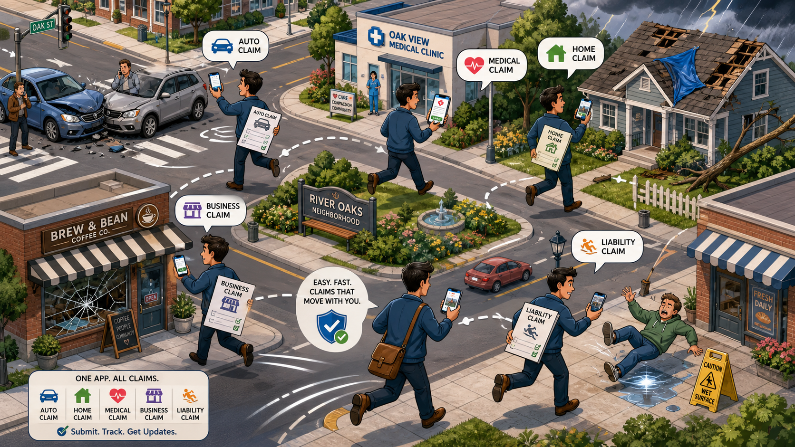

# Claims Neighbourhood Visual Theme

## Overview

The neighbourhood is the **starting point of the entire claims journey**. Before any AI agent or claims officer is involved, something happens in everyday life — a burst pipe, a fender-bender, a small fire, a lost suitcase — and a customer suddenly needs to make a claim.

The neighbourhood theme shows this moment: ordinary people in ordinary places, facing the unexpected events that **trigger** the claims office to spring into action.

It is presented as a **voxel-style miniature town**, sitting alongside the claims office diorama. Customers can be seen running, calling, or hurrying from their incident location toward the **Zava Claims Office** at the centre of the neighbourhood.

---

## Narrative Purpose

The neighbourhood exists to answer one question:

> “Where do claims actually come from?”

It visually anchors the demo by showing:

- The **incident** (the insured event happening in real life)
- The **customer reaction** (worry, urgency, confusion)
- The **journey to the claims office** (the hand-off into the AI claims workflow)

Once a customer reaches the office door, the office theme takes over and the specialised AI agents begin their work.

---

## Neighbourhood Atmosphere

The neighbourhood should feel:

- Familiar and everyday
- Friendly and approachable
- Slightly stylised, not realistic
- Calm overall, but with small pockets of "something just happened"
- Diverse — homes, shops, roads, a small business strip, a travel hub

It should look like a **miniature voxel town** with:

- Tree-lined streets
- Suburban houses with gardens and driveways
- A small high street with cafés and shops
- A roundabout or intersection
- A car park
- A small airport gate or train station corner
- Streetlights, post boxes, benches, and bins
- The Zava Claims Office building visible at the centre or edge as the destination

The neighbourhood layout should feel:

- Walkable
- Clearly zoned (residential, retail, transit)
- Spacious enough to show movement
- Easy to read at a glance from a bird’s-eye view

---

## Incident Zones

The neighbourhood is organised into **incident zones**, each tied to a customer persona and an insurance product. These zones act as the **triggers** for claims that flow into the office.

### 1. Residential Street — Home Insurance

- Suburban houses, gardens, fences
- Featured incident: **burst pipe** at Michael Harris’s kitchen
- Visual cues: water puddle on the floor, a small "!" alert above the house, a plumber van parked outside

### 2. Main Road / Intersection — Motor Insurance

- A roundabout or traffic-light intersection
- Featured incident: **rear-end car accident** involving Aisha Khan
- Visual cues: two voxel cars touching bumpers, hazard triangle, a tow truck approaching

### 3. High Street — Small Business Insurance

- Row of shops and cafés
- Featured incident: **electrical fire / smoke damage** at Tom Bradley’s café
- Visual cues: faint smoke wisps, a "Closed" sign, a fire truck nearby

### 4. Travel Hub — Travel Insurance

- A small airport gate, train station, or taxi rank
- Featured incident: **lost luggage** for Grace Williams
- Visual cues: a single suitcase missing from a luggage trolley, a worried traveller on a phone

### 5. Quiet Suburb Home — Life Insurance

- A calm, respectful house scene set slightly apart
- Featured situation: **bereavement claim** by Robert Chen
- Visual cues: gentle lighting, a parked family car, no alarm or chaos — handled with care and tone

Each zone should be visually distinct but stylistically consistent so the whole town reads as one place.

---

## The Customer Journey Through the Neighbourhood

Each customer follows a simple, readable path on screen:

1. **Incident happens** in their zone (small visual alert appears).
2. **Customer reacts** — phone in hand, worried expression, looking around.
3. **Customer leaves** the incident location.
4. **Customer travels** along streets toward the Zava Claims Office.
5. **Customer arrives** at the office reception — handing the story over to the AI claims agents.

This journey should feel like a tiny living diorama, with multiple customers in motion at the same time, each carrying their own claim story toward the same destination.

---

## Visual Direction

Use the same **voxel / isometric style** as the claims office so the two scenes feel like one connected world.

Important visual characteristics:

- Bird’s-eye or high isometric camera angle
- Miniature voxel town diorama feeling
- Soft, friendly colour palette (greens, warm neutrals, sky blues)
- Clear silhouettes for houses, cars, shops, and people
- Small, readable incident markers (e.g. "!" bubbles, smoke puffs, water drops)
- Voxel customer characters matching the staff style of the office
- Visible roads and walkways connecting every incident zone to the office
- The Zava Claims Office as the **most prominent building**, acting as a visual anchor

Avoid:

- Graphic or distressing depictions of accidents
- Real brands, logos, or recognisable locations
- Overly dark, dramatic, or disaster-movie aesthetics
- Crowds or chaotic street scenes
- Photo-realistic rendering

The tone should always remain **calm, hopeful, and solvable** — the message is "something went wrong, but help is just down the street."

---

## Incident Markers

Each active incident in the neighbourhood should have a small, consistent marker so viewers can quickly spot what is going on:

- A floating **"!" bubble** above the affected house, car, shop, or person
- An **icon** indicating the claim type:
  - Water drop — home / burst pipe
  - Car — motor accident
  - Flame / smoke — business fire
  - Suitcase — travel / lost luggage
  - Soft heart — life insurance / bereavement
- A subtle **path line** showing the customer’s route to the claims office

Markers should be informative, not alarming.

---

## Connection to the Claims Office

The neighbourhood and the office are designed to be viewed together:

- The **Zava Claims Office** sits at the centre or edge of the neighbourhood.
- Customers physically walk, drive, or are shown travelling toward it.
- When a customer enters the office, the camera can transition into the **office theme** (`theme_office.md`), where the AI claims agents take over.
- The neighbourhood is the **trigger**; the office is the **response**.

Together they tell the full claims story:

> Life happens out here → claims are handled in there.

---

## Suggested On-Screen Labels

To help viewers read the scene at a glance, use light, friendly labels:

- "Residential — Home Claims"
- "Main Road — Motor Claims"
- "High Street — Business Claims"
- "Travel Hub — Travel Claims"
- "Family Home — Life Claims"
- "Zava Claims Office"

Labels should feel like map pins, not advertising.

---

## Summary

The neighbourhood theme is the **origin point** of every claim in the demo. It shows real people in everyday situations encountering the kinds of events that insurance is designed to protect them from. By visualising the incident, the worry, and the short journey to the Zava Claims Office, the neighbourhood gives the claims process a clear, human starting point — and sets up the seamless hand-off into the AI-powered claims office where each specialised agent begins their work.
