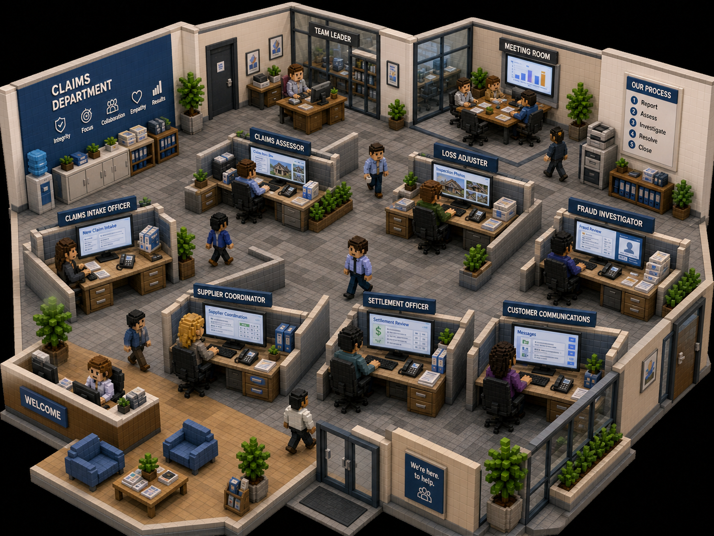

# Claims Office Visual Theme

> Part of **Claims Team in a Day** — the AI claims office demo for **Zava Insurance**.

## Overview

The visual theme for *Claims Team in a Day* is a **voxel-style Zava Insurance claims department**, presented as a miniature isometric diorama. The office should feel professional, organised, approachable, and busy but not chaotic.

---

## Office Atmosphere

The office should look like a miniature isometric diorama with:

- A reception or welcome area
- Open walkways
- Clearly labelled departments
- Staff working at desks
- Some staff walking between departments
- Glass meeting rooms
- Plants, filing cabinets, phones, paperwork, and monitors
- A “Claims Department” identity wall
- An “Our Process” board showing the claim lifecycle

The office layout should feel:

- Professional
- Organised
- Approachable
- Busy but not chaotic
- Spacious enough for staff movement
- Clearly divided into functional departments

---

## Office Departments

The office should be arranged into visible, distinct zones:

- Reception / Welcome Area
- Claims Intake Department
- Claims Assessment Department
- Loss Adjusting Department
- Fraud Investigation Department
- Supplier Coordination Department
- Settlement Department
- Customer Communications Department
- Team Leader Office
- Meeting Room

The departments should not feel cramped. Leave open walkways between them so staff characters can move around and collaborate.

---

## Visual Direction

Use a voxel / isometric style.

Important visual characteristics:

- Bird’s-eye or high isometric camera angle
- Miniature office diorama feeling
- Clear department labels
- Blue and neutral corporate palette
- Clean desk clusters
- Monitors showing simple claims workflow screens
- Staff seated and working
- Some staff walking between departments
- Glass meeting rooms
- Plants and filing storage for warmth and realism
- Professional but approachable atmosphere

Avoid:

- Overly chaotic office layouts
- Dense, unreadable clutter
- Real company logos
- Sensitive customer information
- Hyper-realistic photo style for the final theme

---

## Process Board

A visible "Our Process" board should be displayed in the office, showing the claim lifecycle:

1. Report
2. Assess
3. Investigate
4. Resolve
5. Close
